```mermaid
flowchart TB
    subgraph current["FS Mod Manager.csproj"]
        MAIN["<b>📦&nbsp;FS Mod Manager.csproj</b><br/><small>net6.0-windows7.0</small>"]
        click MAIN "#fs22-mod-managerfs-mod-managercsproj"
    end

```

# Projects and dependencies analysis

This document provides a comprehensive overview of the projects and their dependencies in the context of upgrading to .NETCoreApp,Version=v10.0.

## Table of Contents

- [Executive Summary](#executive-Summary)
  - [Highlevel Metrics](#highlevel-metrics)
  - [Projects Compatibility](#projects-compatibility)
  - [Package Compatibility](#package-compatibility)
  - [API Compatibility](#api-compatibility)
- [Aggregate NuGet packages details](#aggregate-nuget-packages-details)
- [Top API Migration Challenges](#top-api-migration-challenges)
  - [Technologies and Features](#technologies-and-features)
  - [Most Frequent API Issues](#most-frequent-api-issues)
- [Projects Relationship Graph](#projects-relationship-graph)
- [Project Details](#project-details)

  - [FS22 Mod Manager\FS Mod Manager.csproj](#fs22-mod-managerfs-mod-managercsproj)

## Executive Summary

### Highlevel Metrics

| Metric | Count | Status |
| :--- | :---: | :--- |
| Total Projects | 1 | All require upgrade |
| Total NuGet Packages | 0 | All compatible |
| Total Code Files | 8 |  |
| Total Code Files with Incidents | 8 |  |
| Total Lines of Code | 3511 |  |
| Total Number of Issues | 2703 |  |
| Estimated LOC to modify | 2702+ | at least 77.0% of codebase |

### Projects Compatibility

| Project | Target Framework | Difficulty | Package Issues | API Issues | Est. LOC Impact | Description |
| :--- | :---: | :---: | :---: | :---: | :---: | :--- |
| [FS22 Mod Manager\FS Mod Manager.csproj](#fs22-mod-managerfs-mod-managercsproj) | net6.0-windows7.0 | 🟡 Medium | 0 | 2702 | 2702+ | WinForms, Sdk Style = True |

### Package Compatibility

| Status | Count | Percentage |
| :--- | :---: | :---: |
| ✅ Compatible | 0 | 0.0% |
| ⚠️ Incompatible | 0 | 0.0% |
| 🔄 Upgrade Recommended | 0 | 0.0% |
| ***Total NuGet Packages*** | ***0*** | ***100%*** |

### API Compatibility

| Category | Count | Impact |
| :--- | :---: | :--- |
| 🔴 Binary Incompatible | 2663 | High - Require code changes |
| 🟡 Source Incompatible | 39 | Medium - Needs re-compilation and potential conflicting API error fixing |
| 🔵 Behavioral change | 0 | Low - Behavioral changes that may require testing at runtime |
| ✅ Compatible | 2716 |  |
| ***Total APIs Analyzed*** | ***5418*** |  |

## Aggregate NuGet packages details

| Package | Current Version | Suggested Version | Projects | Description |
| :--- | :---: | :---: | :--- | :--- |

## Top API Migration Challenges

### Technologies and Features

| Technology | Issues | Percentage | Migration Path |
| :--- | :---: | :---: | :--- |
| Windows Forms | 2663 | 98.6% | Windows Forms APIs for building Windows desktop applications with traditional Forms-based UI that are available in .NET on Windows. Enable Windows Desktop support: Option 1 (Recommended): Target net9.0-windows; Option 2: Add <UseWindowsDesktop>true</UseWindowsDesktop>; Option 3 (Legacy): Use Microsoft.NET.Sdk.WindowsDesktop SDK. |
| Legacy Configuration System | 37 | 1.4% | Legacy XML-based configuration system (app.config/web.config) that has been replaced by a more flexible configuration model in .NET Core. The old system was rigid and XML-based. Migrate to Microsoft.Extensions.Configuration with JSON/environment variables; use System.Configuration.ConfigurationManager NuGet package as interim bridge if needed. |
| GDI+ / System.Drawing | 2 | 0.1% | System.Drawing APIs for 2D graphics, imaging, and printing that are available via NuGet package System.Drawing.Common. Note: Not recommended for server scenarios due to Windows dependencies; consider cross-platform alternatives like SkiaSharp or ImageSharp for new code. |
| Windows Forms Legacy Controls | 1 | 0.0% | Legacy Windows Forms controls that have been removed from .NET Core/5+ including StatusBar, DataGrid, ContextMenu, MainMenu, MenuItem, and ToolBar. These controls were replaced by more modern alternatives. Use ToolStrip, MenuStrip, ContextMenuStrip, and DataGridView instead. |

### Most Frequent API Issues

| API | Count | Percentage | Category |
| :--- | :---: | :---: | :--- |
| T:System.Windows.Forms.ToolStripMenuItem | 429 | 15.9% | Binary Incompatible |
| T:System.Windows.Forms.TextBox | 177 | 6.6% | Binary Incompatible |
| T:System.Windows.Forms.Button | 154 | 5.7% | Binary Incompatible |
| T:System.Windows.Forms.Label | 136 | 5.0% | Binary Incompatible |
| T:System.Windows.Forms.ListBox | 115 | 4.3% | Binary Incompatible |
| P:System.Windows.Forms.ToolStripItem.Text | 96 | 3.6% | Binary Incompatible |
| P:System.Windows.Forms.TextBox.Text | 94 | 3.5% | Binary Incompatible |
| T:System.Windows.Forms.ToolStripStatusLabel | 62 | 2.3% | Binary Incompatible |
| P:System.Windows.Forms.ToolStripItem.Size | 57 | 2.1% | Binary Incompatible |
| P:System.Windows.Forms.ToolStripItem.Name | 57 | 2.1% | Binary Incompatible |
| T:System.Windows.Forms.ToolStripSeparator | 54 | 2.0% | Binary Incompatible |
| T:System.Windows.Forms.DialogResult | 47 | 1.7% | Binary Incompatible |
| P:System.Windows.Forms.Control.Name | 46 | 1.7% | Binary Incompatible |
| M:System.Windows.Forms.ToolStripMenuItem.#ctor | 46 | 1.7% | Binary Incompatible |
| P:System.Windows.Forms.ToolStripMenuItem.Checked | 45 | 1.7% | Binary Incompatible |
| P:System.Windows.Forms.Control.Size | 44 | 1.6% | Binary Incompatible |
| T:System.Windows.Forms.Control.ControlCollection | 42 | 1.6% | Binary Incompatible |
| P:System.Windows.Forms.Control.Controls | 42 | 1.6% | Binary Incompatible |
| M:System.Windows.Forms.Control.ControlCollection.Add(System.Windows.Forms.Control) | 42 | 1.6% | Binary Incompatible |
| P:System.Windows.Forms.Control.TabIndex | 42 | 1.6% | Binary Incompatible |
| P:System.Windows.Forms.Control.Location | 42 | 1.6% | Binary Incompatible |
| T:System.Windows.Forms.Panel | 42 | 1.6% | Binary Incompatible |
| E:System.Windows.Forms.ToolStripItem.Click | 38 | 1.4% | Binary Incompatible |
| P:System.Configuration.ApplicationSettingsBase.Item(System.String) | 34 | 1.3% | Source Incompatible |
| T:System.Windows.Forms.ListBox.ObjectCollection | 32 | 1.2% | Binary Incompatible |
| P:System.Windows.Forms.ListBox.Items | 32 | 1.2% | Binary Incompatible |
| T:System.Windows.Forms.StatusStrip | 26 | 1.0% | Binary Incompatible |
| T:System.Windows.Forms.Keys | 26 | 1.0% | Binary Incompatible |
| P:System.Windows.Forms.ListBox.Text | 25 | 0.9% | Binary Incompatible |
| T:System.Windows.Forms.ContextMenuStrip | 23 | 0.9% | Binary Incompatible |
| P:System.Windows.Forms.Label.Text | 18 | 0.7% | Binary Incompatible |
| T:System.Windows.Forms.MessageBoxButtons | 16 | 0.6% | Binary Incompatible |
| T:System.Windows.Forms.MenuStrip | 16 | 0.6% | Binary Incompatible |
| E:System.Windows.Forms.Control.Click | 14 | 0.5% | Binary Incompatible |
| P:System.Windows.Forms.ButtonBase.UseVisualStyleBackColor | 14 | 0.5% | Binary Incompatible |
| P:System.Windows.Forms.ButtonBase.Text | 14 | 0.5% | Binary Incompatible |
| M:System.Windows.Forms.Button.#ctor | 14 | 0.5% | Binary Incompatible |
| P:System.Windows.Forms.Label.AutoSize | 13 | 0.5% | Binary Incompatible |
| T:System.Windows.Forms.ToolStripItemCollection | 13 | 0.5% | Binary Incompatible |
| M:System.Windows.Forms.ToolStripItemCollection.AddRange(System.Windows.Forms.ToolStripItem[]) | 13 | 0.5% | Binary Incompatible |
| M:System.Windows.Forms.Label.#ctor | 13 | 0.5% | Binary Incompatible |
| P:System.Windows.Forms.ListBox.ObjectCollection.Count | 13 | 0.5% | Binary Incompatible |
| P:System.Windows.Forms.ListBox.SelectedIndex | 11 | 0.4% | Binary Incompatible |
| M:System.Windows.Forms.Control.ResumeLayout(System.Boolean) | 9 | 0.3% | Binary Incompatible |
| M:System.Windows.Forms.Control.SuspendLayout | 9 | 0.3% | Binary Incompatible |
| M:System.Windows.Forms.ToolStripSeparator.#ctor | 9 | 0.3% | Binary Incompatible |
| M:System.Windows.Forms.ListBox.ObjectCollection.Add(System.Object) | 8 | 0.3% | Binary Incompatible |
| F:System.Windows.Forms.DialogResult.OK | 8 | 0.3% | Binary Incompatible |
| M:System.Windows.Forms.CommonDialog.ShowDialog | 8 | 0.3% | Binary Incompatible |
| T:System.Windows.Forms.MessageBox | 8 | 0.3% | Binary Incompatible |

## Projects Relationship Graph

Legend:
📦 SDK-style project
⚙️ Classic project

## Project Details

### FS22 Mod Manager\FS Mod Manager.csproj

#### Project Info

- **Current Target Framework:** net6.0-windows7.0
- **Proposed Target Framework:** net10.0-windows
- **SDK-style**: True
- **Project Kind:** WinForms
- **Dependencies**: 0
- **Dependants**: 0
- **Number of Files**: 11
- **Number of Files with Incidents**: 8
- **Lines of Code**: 3511
- **Estimated LOC to modify**: 2702+ (at least 77.0% of the project)

#### Dependency Graph

Legend:
📦 SDK-style project
⚙️ Classic project

### API Compatibility

| Category | Count | Impact |
| :--- | :---: | :--- |
| 🔴 Binary Incompatible | 2663 | High - Require code changes |
| 🟡 Source Incompatible | 39 | Medium - Needs re-compilation and potential conflicting API error fixing |
| 🔵 Behavioral change | 0 | Low - Behavioral changes that may require testing at runtime |
| ✅ Compatible | 2716 |  |
| ***Total APIs Analyzed*** | ***5418*** |  |

#### Project Technologies and Features

| Technology | Issues | Percentage | Migration Path |
| :--- | :---: | :---: | :--- |
| Windows Forms Legacy Controls | 1 | 0.0% | Legacy Windows Forms controls that have been removed from .NET Core/5+ including StatusBar, DataGrid, ContextMenu, MainMenu, MenuItem, and ToolBar. These controls were replaced by more modern alternatives. Use ToolStrip, MenuStrip, ContextMenuStrip, and DataGridView instead. |
| GDI+ / System.Drawing | 2 | 0.1% | System.Drawing APIs for 2D graphics, imaging, and printing that are available via NuGet package System.Drawing.Common. Note: Not recommended for server scenarios due to Windows dependencies; consider cross-platform alternatives like SkiaSharp or ImageSharp for new code. |
| Legacy Configuration System | 37 | 1.4% | Legacy XML-based configuration system (app.config/web.config) that has been replaced by a more flexible configuration model in .NET Core. The old system was rigid and XML-based. Migrate to Microsoft.Extensions.Configuration with JSON/environment variables; use System.Configuration.ConfigurationManager NuGet package as interim bridge if needed. |
| Windows Forms | 2663 | 98.6% | Windows Forms APIs for building Windows desktop applications with traditional Forms-based UI that are available in .NET on Windows. Enable Windows Desktop support: Option 1 (Recommended): Target net9.0-windows; Option 2: Add <UseWindowsDesktop>true</UseWindowsDesktop>; Option 3 (Legacy): Use Microsoft.NET.Sdk.WindowsDesktop SDK. |

